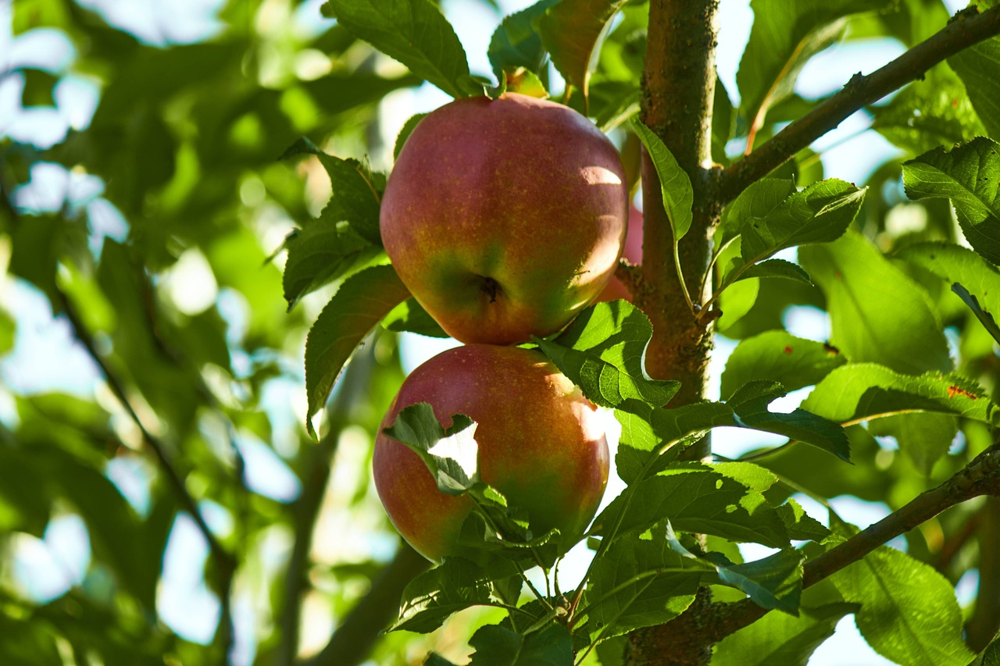

# Plant Pathology

## Description
사과나무의 병리학적 특성을 구분하는 웹 앱

## 데이터
식물 병리학 챌린지 Kaggle 경진대회 문제

Plant Pathology 2020 데이터 세트를 사용

The dataset is available at [Kaggle](https://www.kaggle.com/competitions/plant-pathology-2020-fgvc7).

## 목표
사과나무의 엽면병 분류

## 모델 설명
[REMAD ME MODEL](https://github.com/luxetverit/miniproject4/blob/main/README_model.md)

## 서비스
free to use

## 시연 영상
수동 (직접 시연)

## 조원(이름순)
### 남정우
 - 역할 : 학습모델 제공 및 세팅, 프로젝트 진행 조율
 - Trouble Shooting :  
    requirements 에 몇몇 모듈이 누락되어 앱 실행하는데 어려움을 겪었다.  
 - 의견 : 
    streamlit 프레임워크가 사용하기 편했다.  
    자바스크립트를 활용하면 화면을 조금 더 디테일하게 꾸밀 수 있을것 같다.
    다양한 훈련 데이터를 가지고 더 많은 종류의 질병들을 구분해보고 싶다.

### 양효준
 - 역할 : 화면 구성 및 캠 인식모듈 설정
 - Trouble Shooting : 
 - 의견 : 
    기존에 학습된 모델을 이용해서 서비스를 개발하는 경험이 흥미로웠다.  
    결과물을 만들어 내는 것에만 급급해 과정을 기록해 두지 못한 점이 아쉽다.   
    다음 프로젝트부터는 마주하는 문제들과 해결 과정을 따로 기록하며 프로젝트를 진행해야겠다.
     

### 정제경
 - 역할
 - Trouble Shooting
 - 의견

### 주한솔
 - 역할
 - Trouble Shooting
 - 의견
