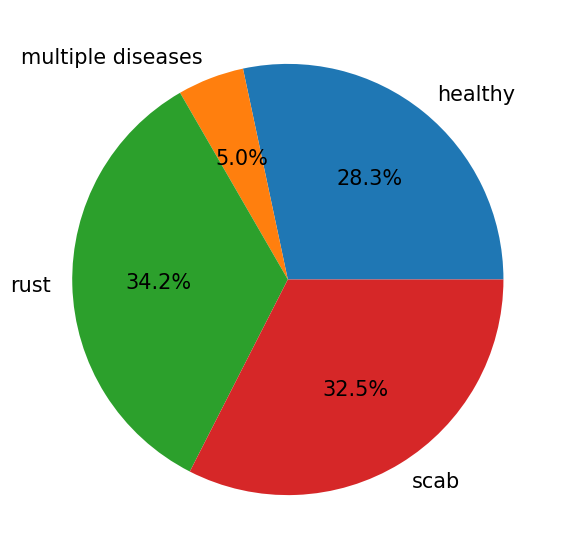
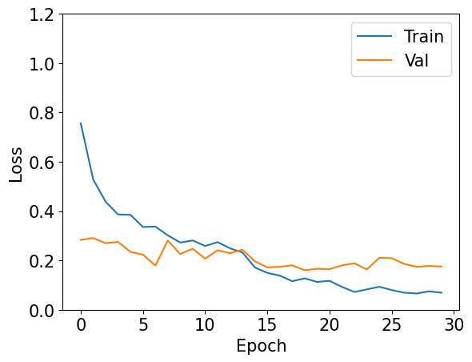
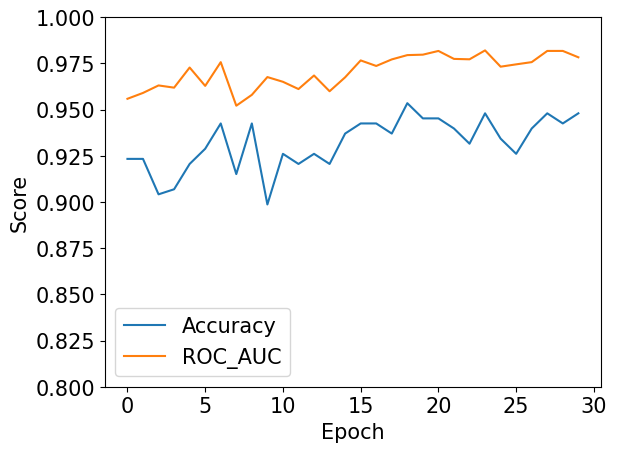
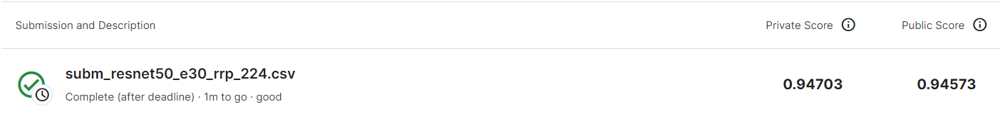

# Plant Pathology
[](https://share.streamlit.io/)

## Description
식물 병리학 챌린지 Kaggle 경진대회 문제
Plant Pathology 2020 데이터 세트를 사용

## 데이터
The dataset is available at [Kaggle](https://www.kaggle.com/competitions/plant-pathology-2020-fgvc7).

## 목표
사과나무의 엽면병 분류

## 특징
훈련데이터 1821개



## 설정
```
이미지 변환 : 사이즈, 대비, 밝기, 수평, 수직, 회전, 정규화
에폭 : 20회
배치사이즈 : 4
이미지 크기 : 224 x 224
```

## 모델
### 모델
ResNet50 

```python
model = models.resnet50(pretrained = True)
for param in model.parameters():
    param.require_grad = False

num_ftrs = model.fc.in_features
model.fc = nn.Sequential(nn.Linear(num_ftrs,512,bias=True),
                          nn.ReLU(),
                          nn.Dropout(p=0.3),
                          nn.Linear(512,4, bias = True))

model = model.to(device)
```

### 손실함수 및 옵티마이저
```python
import torch.nn as nn
from torch import optim

criterion = nn.CrossEntropyLoss()
optimizer = torch.optim.AdamW(model.parameters(), lr=0.0001)
scheduler = optim.lr_scheduler.ReduceLROnPlateau(optimizer, 'min', patience=5, factor=0.1, verbose=True)
```

### 평가
```python
from sklearn.metrics import roc_auc_score
from sklearn.metrics import accuracy_score

print('Epoch : {}/{}...'.format(epoch+1, epochs),
                      'Train Loss : {:.3f} / '.format(train_loss/len(trainloader)),
                      'Valid Loss : {:.3f} / '.format(valid_loss/len(validloader)),
                      'Valid AUC : {:.3f} / '.format(valid_auc),
                      'Valid Accuracy : {:.3f}'.format(valid_accuracy))
```

## 훈련 및 결과
### 손실


### 스코어


## 제출



